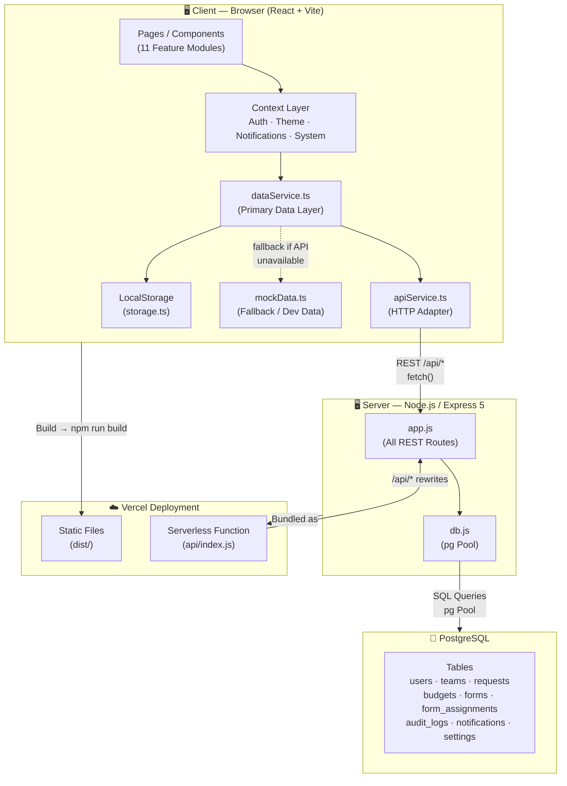
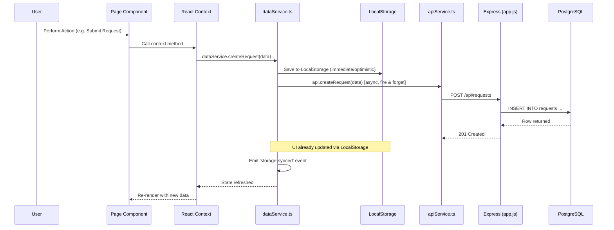
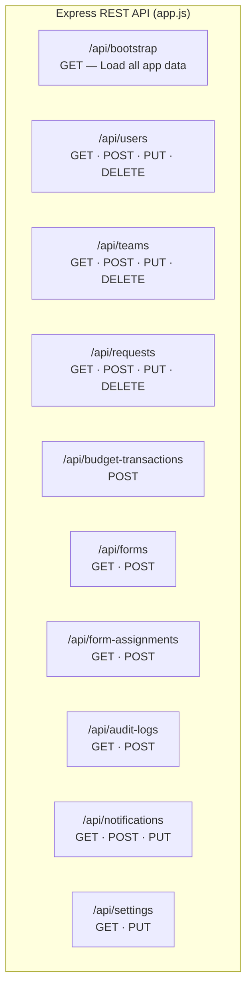
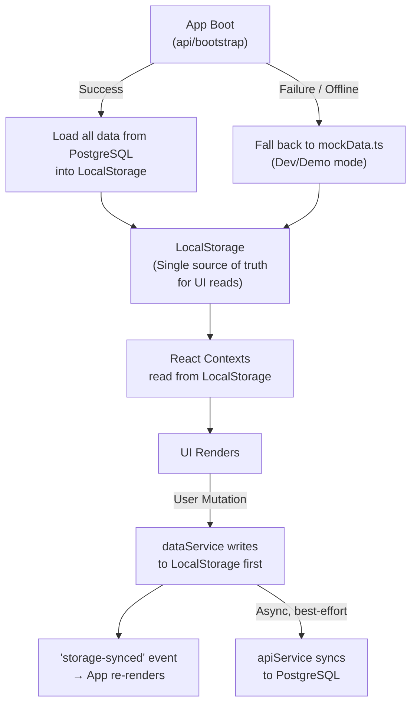
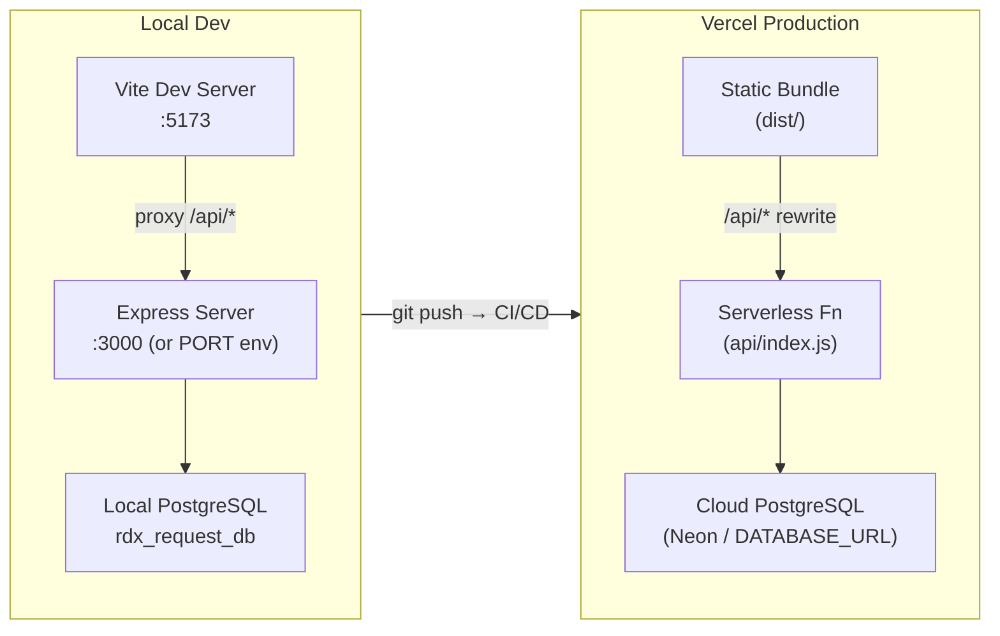

# RDX Request Management System — Working Architecture

## 🗺️ High-Level Architecture

---

## 🔄 Request Lifecycle (Data Flow)

---

## 🏛️ Frontend Layer Breakdown

```mermaid
graph LR
    subgraph PROVIDERS["Provider Tree (main.tsx → App.tsx)"]
        TP["ThemeProvider"]
        AP["AuthProvider"]
        SP["SystemProvider"]
        NP["NotificationProvider"]
        TP --> AP --> SP --> NP
    end

    subgraph LAYOUT["Shell Layout"]
        HDR["Header\n(Search, Notifications, User)"]
        SDB["Sidebar\n(Navigation Links)"]
        CONTENT["Page Content\n(Conditional Render)"]
    end

    subgraph PAGES["Feature Pages"]
        DASH["Dashboard"]
        REQ["Requests + Detail"]
        APR["Approvals Queue"]
        TEAM["Teams"]
        BUD["Budgets"]
        FORM["Forms + Assignments"]
        RPT["Reports"]
        AUD["Audit Logs"]
        USR["Users"]
        SET["Settings"]
    end

    NP --> LAYOUT
    LAYOUT --> PAGES
```

---

## 🌐 API Endpoints Map

---

## 📦 State Management Strategy

---

## 🚀 Deployment Architecture

